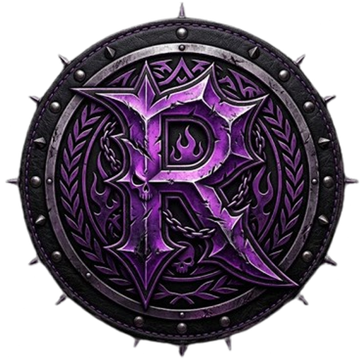

# 🎥 Ripleytia OBS AI Studio (v1.5.1 Güncel Versiyon)

<p align="center">
  
</p>

<p align="center">
  <b>Canlı Yayıncılar ve Rekabetçi Espor Oyuncuları İçin Yapay Zeka Destekli OBS Studio & Sahne/Overlay Stüdyosu</b><br>
  <i>EsportsDesignFactory • Grunge Doku Katmanları • 3D Extruded Tipografi • Neon Volumetric Aura • Donma Hatası Düzeltmesi</i>
</p>

<p align="center">
  
  
  
  
  
</p>

---

## 📖 Genel Bakış

**Ripleytia OBS AI Studio (v1.5.0)**, bu sürümde tamamen yeniden yazılmış **EsportsDesignFactory** grafik motoruyla geliyor. Syhd3, WTCN ve VCT turnuva paketlerinin ayırt edici özelliklerini — gerçek doku katmanları, 3D extruded metin gölgeleri, neon volumetric bloom aura ve yapısal anti-repetition — saf Python/Pillow ile üretiyor.

Her "Oluştur" tuşuna basıldığında, motor aynı şablonu modifiye etmez; **DesignHistoryManager** son 10 tasarımı takip eder ve %50'den fazla yapısal benzerlik tespit ederse tasarımı reddederek tamamen farklı bir kombinasyon seçer.

---

## 🚀 Sürüm 1.5.0 ile Gelen Profesyonel Yenilikler

### 1. 🏭 EsportsDesignFactory — Tamamen Yeni Grafik Motoru

Eski şablon tabanlı motor kaldırıldı. Yerini **5 bağımsız yapısal trait** üzerine kurulu fabrika mimarisi aldı:

| Trait | Havuz (Seçenekler) |
|---|---|
| **texture_type** | heavy_grunge_scratch, dark_brushed_metal, carbon_fiber_weave, distressed_concrete, smoke_light_leaks |
| **emblem_shape** | hexagon, shield, slash_strips, diamond_cut, sector_wedge, chamfer_rect |
| **typo_style** | 3d_extrude_heavy, outline_glow, italic_slash_impact, brutalist_block, hud_mono_neon |
| **aura_family** | crimson_red, cyber_cyan, electric_gold, void_purple, acid_green |
| **layout** | center_hero, left_wedge, bottom_ribbon, full_bleed_hud, asymmetric_tilt |

### 2. 🎨 Grunge Doku Arka Planlar (Procedural Texture)
Artık düz gradyan yok! Her arka plan gerçek bir doku katmanıyla başlar:
* **heavy_grunge_scratch:** 400 adet rastgele çizgi, farklı alfa/kalınlık/eğim kombinasyonlarıyla
* **dark_brushed_metal:** 500 yatay + 120 diyagonal ışık sıyırması
* **carbon_fiber_weave:** 12px tile dokuma, parlak/koyu değişimli karbon kafes
* **distressed_concrete:** 800 rastgele nokta + beton çatlak çizgileri
* **smoke_light_leaks:** 6 adet neon bloom dairesi, gerçek ışık sızıntısı efekti

### 3. ✍️ 3D Extruded Tipografi
Metinler artık 12 katmanlı derinlik gölgesiyle çiziliyor:
* 12→1 arası ofsetlerde degrade extrude geçişi (koyu → parlak)
* 3px kalınlığında dış stroke ring (neon renkte)
* En üstte saf face yazı katmanı

### 4. 💥 Neon Volumetric Bloom Aura
Her emblem/logo arkasında gerçek neon parlama:
* 22 adımlı konsantrik ellipse (en dıştan içe doğru opaklık artışı)
* Aura rengi traits'ten (crimson_red, cyber_cyan, vb.) otomatik belirlenir
* RGBA composite ile diğer katmanlarla gerçekçi karışım

### 5. 🔷 6 Emblem Şekli
`hexagon`, `shield`, `slash_strips`, `diamond_cut`, `sector_wedge`, `chamfer_rect` — her basışta rastgele seçilir, iç/dış renk ayrımı ile çizilir

### 6. 🗺️ 5 Tam Farklı Kompozisyon Düzeni
* **center_hero:** Ortada büyük emblem + bloom + 3D başlık
* **left_wedge:** Sol açılı panel, sağda büyük tipografi
* **bottom_ribbon:** Üstte emblem, altta agresif şerit bilgi barı
* **full_bleed_hud:** HUD köşe bracketi grid, mono font tipografi
* **asymmetric_tilt:** Diyagonal slash bölücü, iki bölgeli asimetrik yerleşim

### 7. 🧬 DesignHistoryManager (%50 Benzerlik Eşiği)
* Son 10 tasarım 5 trait üzerinden kıyaslanır
* Benzerlik ≥ %50 → otomatik reject + re-mutate (max 20 deneme)

---

## 🔐 Güvenlik & Dosya Doğrulama

Uygulama açık kaynak kodludur, hiçbir reklam veya arka plan zararlısı içermez. Windows Defender tarafından taranmış ve 0 tehdit onaylanmıştır.

* **Dosya Adı:** `Ripleytia OBS AI Studio.exe`
* **SHA-256 Özeti:**
  ```text
  b4de135b1ea272946d1d69c3000f0e4371d80cc62fef6c553412dd8e8c57250a
  ```
* **VirusTotal Raporu:** [VirusTotal Doğrulama Bağlantısı](https://www.virustotal.com/gui/file/b4de135b1ea272946d1d69c3000f0e4371d80cc62fef6c553412dd8e8c57250a)

---

## 🚀 Kurulum ve Çalıştırma

### Yöntem 1: Hazır `.exe` İle Çalıştırma (Önerilen)
1. [Releases](../../releases) bölümünden **`Ripleytia.OBS.AI.Studio.exe`** veya **`Ripleytia.OBS.AI.Studio.zip`** dosyasını indirin.
2. Dosyayı çalıştırın.
3. Donanım ve hız testinizi yapın, dilediğiniz profili veya sahne paketini tek tıkla OBS'e ekleyin!

### Yöntem 2: Kaynak Koddan Çalıştırma
```powershell
# Depoyu klonlayın
git clone https://github.com/ripleytia/ripleytia-obs-studio.git
cd ripleytia-obs-studio

# Bağımlılıkları yükleyin
pip install customtkinter pillow requests

# Uygulamayı başlatın
python main.py
```

### Yöntem 3: Kendi `.exe` Dosyanızı Derleme
```powershell
python build_exe.py
```

---

## 📁 Proje Dizin Yapısı

```text
ripleytia-obs-studio/
├── assets/
│   ├── icon.ico            # Windows .ico simgesi (16x16 - 256x256)
│   ├── logo.png            # 512x512 yüksek çözünürlüklü R logosu
│   ├── logo_64.png         # Başlık çubuğu için 64x64 logo
│   └── bg_dark.png         # Düşük opaklıklı gothic mor arka plan
├── engine/
│   ├── hardware.py         # Donanım, encoder ve OBS tespit motoru
│   ├── speedtest.py        # Cloudflare CDN canlı hız testi motoru
│   ├── obs_engine.py       # OBS profil, sahne, replay buffer ve ses motoru
│   ├── ai_designer.py      # EsportsDesignFactory v1.5.0 — Grunge+3D+Neon
│   └── performance_monitor.py # 0 ms gecikmeli CPU, RAM & OBS süreç monitörü
├── main.py                 # CustomTkinter 8 sekmeli modern grafik arayüzü
├── build_exe.py            # PyInstaller derleme betiği
├── version_info.txt        # Windows PE binary sürüm bilgisi (v1.5.0)
├── .gitignore              # Git yoksayma kuralları
└── README.md               # Detaylı dokümantasyon
```

---

## 👤 Geliştirici & Lisans

* **Geliştirici:** Ripleytia
* **Lisans:** [MIT License](LICENSE)
* **Destek & Geri Bildirim:** Her türlü öneri veya hata bildirimi için [Issues](../../issues) bölümünü kullanabilirsiniz.
